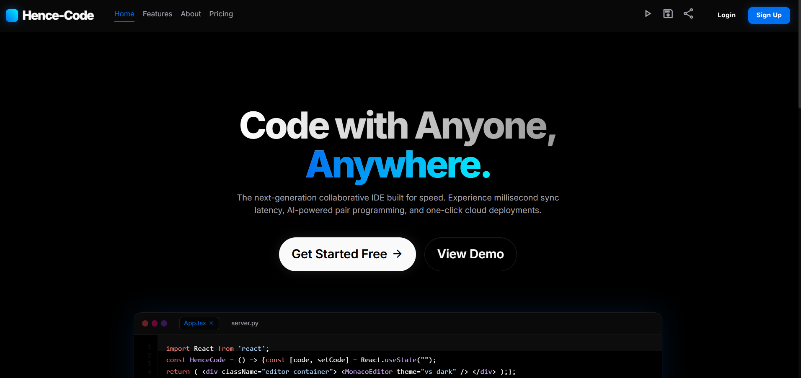
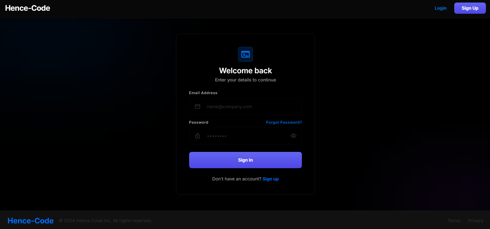
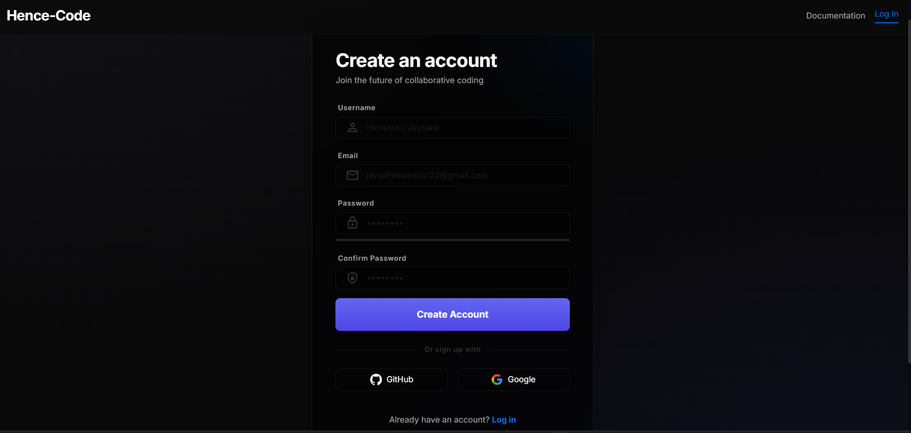
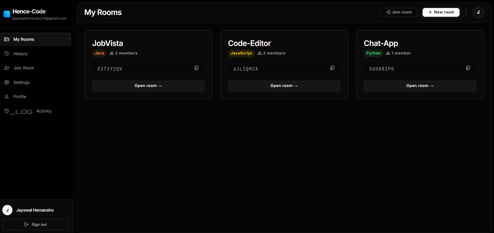
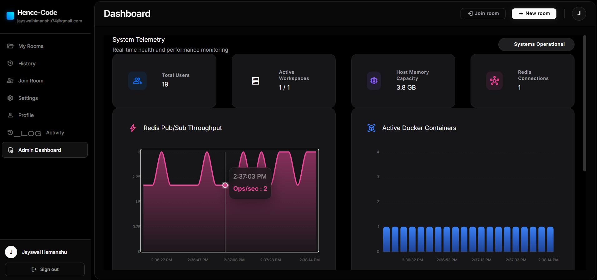
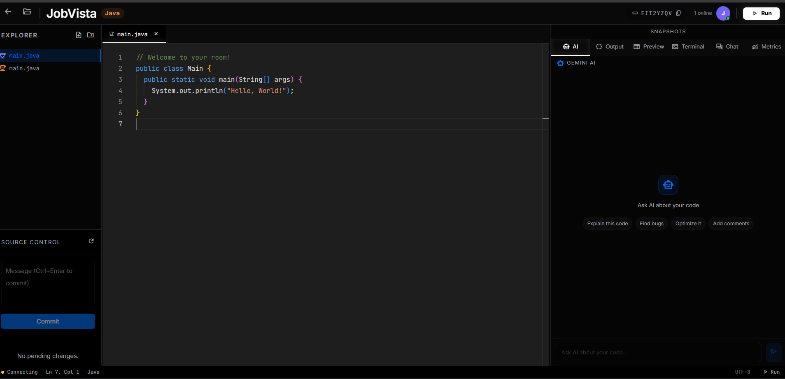

<h1 align="center">Hence-Code</h1>

  <strong>A highly scalable, distributed, real-time collaborative code editor and execution engine.</strong>

  
  
  
  
  
  

## 🚀 Overview

Hence-Code is a full-stack, production-ready integrated development environment accessible directly from the browser. Built with a distributed architecture, it enables multiple developers to collaborate on code in real-time with sub-millisecond latency. 

Code execution is isolated securely within dynamic Docker containers, offering runtime support for Node.js, Python, Java, and Ubuntu environments. The system features a robust WebSocket backbone, stateless JWT authentication via secure HttpOnly cookies, and comprehensive rate limiting.

## ✨ Key Features

*   **Distributed Architecture:** Multi-node capable backend using Redis Pub/Sub for coordination.
*   **Real-time Collaboration:** Conflict-free replicated data types (CRDTs) powered by Yjs and WebSockets for Google Docs-style live editing.
*   **Isolated Workspace Engine:** Every project runs in a dedicated Docker container ensuring security, isolation, and resource management.
*   **Runtime Registry:** Native execution support for `Node.js`, `Python`, `Java`, and a raw `Ubuntu` terminal.
*   **Workspace Snapshots:** Save, restore, and version-control workspace states instantly.
*   **Admin Analytics Dashboard:** Monitor system metrics, active users, and execution limits in real-time.
*   **Integrated Terminal:** Live shared terminal access directly to the container runtime via WebSockets.
*   **Enterprise Security:** Secure HttpOnly cookies, Google/GitHub OAuth2, strict Rate Limiting (Bucket4j), and comprehensive Security Headers.

## 🏗 Architecture Diagram

> Check out the [Detailed Architecture Guide](docs/ARCHITECTURE.md) for a full breakdown.

The system relies on a React frontend communicating with a Spring Boot backend. Real-time state is synced via WebSockets (SockJS/STOMP) and coordinated across distributed backend nodes using Redis Pub/Sub. Execution requests are proxied securely to the Docker Daemon.

## 🛠 Tech Stack

*   **Frontend:** React, Zustand, Axios, Yjs, CodeMirror 6, Tailwind CSS
*   **Backend:** Java 22, Spring Boot 3, Spring Security, Spring Data JPA, Java Docker API
*   **Database:** PostgreSQL (Relational Data), Redis (Pub/Sub & Rate Limiting)
*   **Infrastructure:** Docker Engine, WebSockets (STOMP)

## 📸 Screenshots

### Landing Page & Authentication

  
  
  

### Dashboard & Management

  
  

### Collaborative Execution Environment

  

## 💻 Local Setup & Deployment

Want to run this yourself? 
1. **[Local Setup Guide](docs/LOCAL_SETUP.md)**: Instructions for running the entire stack locally with Docker Desktop.
2. **[Free Public Deployment Guide](docs/DEPLOYMENT.md)**: How to host this securely on the public internet using Cloudflare Tunnels for free.

## 🔒 Security Features

Security was built-in from day one, achieving a 95/100 internal security audit score:
*   **Fail-Fast Boot:** Application halts if cryptographic keys are weak or missing.
*   **XSS Protection:** `localStorage` is disabled for auth; tokens use `HttpOnly`, `SameSite=Lax` cookies.
*   **OAuth2:** Native Google and GitHub SSO integration.
*   **Rate Limiting:** IP-based protection against brute-force (Login, Register, Password Reset).
*   **Strict Headers:** CSP, HSTS, and X-Frame-Options configured via Spring Security.

Read the full [Security Checklist](docs/SECURITY_CHECKLIST.md) before deployment.

## 🔮 Future Improvements

*   LSP (Language Server Protocol) integration for intelligent code completion.
*   Kubernetes (K8s) Pod allocation instead of direct Docker Daemon control.
*   S3/MinIO integration for long-term workspace snapshot archiving.

## 🤝 Contributing

Contributions, issues, and feature requests are welcome! 
Feel free to check out the [Contributing Guide](CONTRIBUTING.md) if you want to help make Hence-Code even better.

## 📄 License

This project is licensed under the MIT License - see the [LICENSE](LICENSE) file for details.